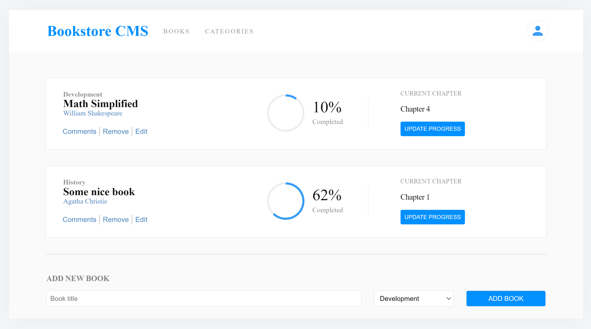

# Bookstore CMS

## Table of Contents

* [About the Project](#about-the-project)
* [Built With](#built-with)
* [Getting Started](#getting-started)
* [Contributing](#contributing)
* [Author](#author)
* [Acknowledgements](#acknowledgements)

## About Project

"Bookstore CMS" is a content management React-Redux app that's meant to help a user add or remove books but most importantly keep tracking data in terms of progress made so far in reading a particular book.

<!--  -->

<!-- ## [Live Demo - GH pages]() -->
## [Live Demo - Netlify](https://book-storecms.netlify.app/)
<!-- ## [Live Demo - Heroku]() -->

## Built With

* ReactJS
* Redux

## Getting Started

* Clone this repo <https://github.com/Lameck1/bookstore>

    ```bash
    git clone https://github.com/Lameck1/bookstore.git
    ```

* Navigate to bookstore folder/directory

    ```bash
    cd bookstore
    ```

* On the comandline, at the project's root, run ```npm install``` to install app dependencies

* Next, run ```npm start``` which will run the app in the development mode.

* Open [http://localhost:3000](http://localhost:3000) to view it in the browser.

* ALTERNATIVELY

  * Just run ```npm run build``` which will build the project and generate output files into the ```build``` directory.

  * Go to ```build``` directory and manually open ```index.html``` to interact with the app

## Contributing

Contributions, issues, and feature requests are welcome!

Feel free to check the [issues page](https://github.com/Lameck1/bookstore/issues)

  1. Fork the Project
  2. Create your Feature Branch (`git checkout -b feature/newFeature`)
  3. Commit your Changes (`git commit -m 'Add some newFeature'`)
  4. Push to the Branch (`git push -u origin feature/newFeature`)
  5. Open a Pull Request

## Author

👤 **Lameck Otieno**

* GitHub: [@githubhandle](https://github.com/Lameck1)
* Twitter: [@twitterhandle](https://twitter.com/lameck721)
* LinkedIn: [LinkedIn](https://www.linkedin.com/in/lameck-odhiambo-642b7077/)
* Portfolio: [Portfolio](https://lameck.me)

## Acknowledgements

* [ReactJS Organization](https://reactjs.org/) for the amazing [Documentation](https://reactjs.org/docs/getting-started.html) on React.
* [Redux Organization](https://redux.js.org/) for the amazing [Redux Essentials Tutorial](https://redux.js.org/tutorials/essentials/part-1-overview-concepts) on React.

## Show your support

Give a ⭐️ if you like this project!